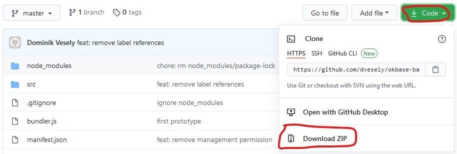
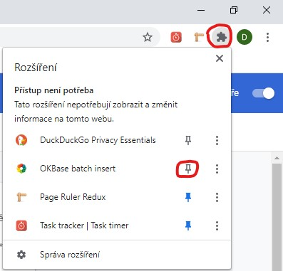
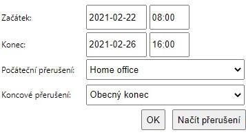

# OKBase batch insert

Rozšíření pro Chrome pro jednodušší přidávání záznamu za určité období po dnech do docházkového systému OKBase.

## Instalace

1. Stahněte si projekt do svého počítače
   - buď pomocí gitu

        ```bash
        git clone https://github.com/dvesely/okbase-batch-insert.git
        ```

   - nebo pomocí **ZIP** souboru

        |  |
        | -- |

2. **V prohlížečí chrome** přejděte do **správce rozšíření**. Do adresního řádku zadejte: chrome://extensions

3. V pravém horním rohu přejděte do **režimu pro vývojáře**.

4. Vlevo se zobrazí 3 nová tlačítka. Klikněte na **Načíst nerozbalené**.

5. **Vyberte složku** (rozbalenou) se **staženým rozšířením**.

6. Pro snadnější používání **připněte rozšíření** na panel.

    |  |
    | --- |

7. Přejděte v **OKBase** na stránku **Plánování docházky**.
8. Otevřete rozšíření.
9. [Nepovinný krok] **Načtěte** si **aktuální** možná **přerušení** pro aplikaci. Pomocí tlačítka **Načíst přerušení**.
10. **Vyplňte formulář** potřebnými daty.

    |  |
    | -- |

11. Po stisknutí tlačíka **OK** by se měli do **OKBase** přidat požadované záznamy.

### Tlačítka

- Tlačítko **OK** slouží pro potvrzení akce a přídání záznamů do OKBase.
- Tlačítko **Načíst přerušení** je pro načtení aktulně možných přerušení v OKBase (select boxy).

## Příklad

Potřebujete si do **OKBase** zadat **Home office** za obodbí **22. - 26. 2. 2021** od **8:00 do 16:00**. Bez tohoto nástroje byste museli ručně vyplnit formulář za každý den stejnými daty (5x). S tímto nástrojem vyplníte data pouze jednou a nástroj za vás automaticky vyplní formulář za každý den.

**Zapisují se pouze pracovní dny. Pokud tedy budete chtít vykázat práci za celý měsíc, tak se do OKBase zapíší pouze dny mimo víkend (státní svátky to nezohledňuje).**

|  |
| --- |

Do **OKBase** se automaticky přidají tyto záznamy.

Přerušení|Od|Do
-|-|-
Home office / Obecný konec|22.02.2021 8:00|22.02.2021 16:00
Home office / Obecný konec|23.02.2021 8:00|23.02.2021 16:00
Home office / Obecný konec|24.02.2021 8:00|24.02.2021 16:00
Home office / Obecný konec|25.02.2021 8:00|25.02.2021 16:00
Home office / Obecný konec|26.02.2021 8:00|26.02.2021 16:00
